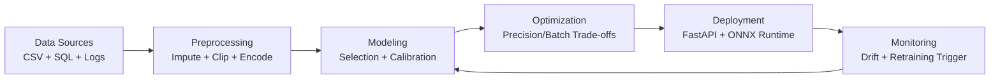

# Architecture Diagram

```mermaid
flowchart LR
    A[Data Sources\nCSV + SQL + Logs] --> B[Preprocessing\nImpute + Clip + Encode]
    B --> C[Modeling\nSelection + Calibration]
    C --> D[Optimization\nPrecision/Batch Trade-offs]
    D --> E[Deployment\nFastAPI + ONNX Runtime]
    E --> F[Monitoring\nDrift + Retraining Trigger]
    F --> C
```

## Workflow charts and visuals

- Pipeline narrative: `systems_overview/workflow.md`
- Trade-off plot artifact: `artifacts/benchmark_tradeoff.png`
